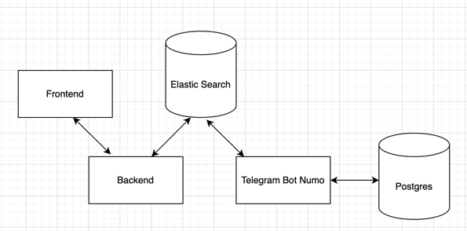

# numo-bot-server

BACKEND

Used technologies: Java, Maven, SpringBoot, ElasticSearch, Hibernate, Swagger.

Deployed to Heroku via next steps:
- heroku login
- heroku create
- git push heroku main

Link to swagger: https://numo-server-669577134b9c.herokuapp.com/swagger-ui/index.html

Process flow:

Stream of messages from telegram bot is redirecting and saving to ElasticSearch database. (Done in «GitHub vovaPetryna»)

ElasticSearch database set up remotely at «https://f563addbf2b345fd84297bf7e748ecdb.us-central1.gcp.cloud.es.io:443»

We have next services:
- UserService
- GroupService
- ScheduleService

In GroupService you can manage groups (add, findbyId, findAll, delete). All groups has unique name for easier recognition.
Group is a set of rules, by which we are filtering users in database.

Group fields:

private Long id;
private String name;
private Origin origin;
private Integer age;
private String location;
private AmountOfAdvices frequency;
private Integer numOfChildren;
private Integer likesMoreThan;
private Integer dislikesMoreThan;
private Boolean hasFinishedRegisterForm;
private ActivityLevel activityLevel;
private String registeredFrom;
private String registeredTo;

In UserService we can get list of users, userById, and all users in group. If search by group id, then are creating custom query to get users by customer defined group fields.
Aggregation for analytics also done here. We have a set of methods to supply frontend with data for graphics.
Also we have a method to save users of group to csv file by groupId.

In ScheduleService we have an api for postponing advices, texts and practices that will be triggered by cron task.
